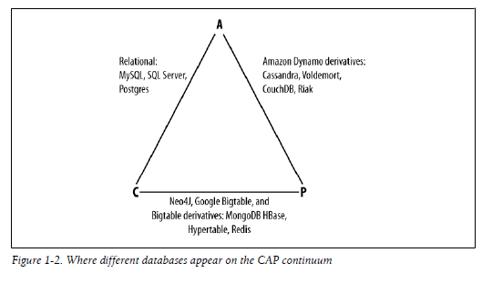
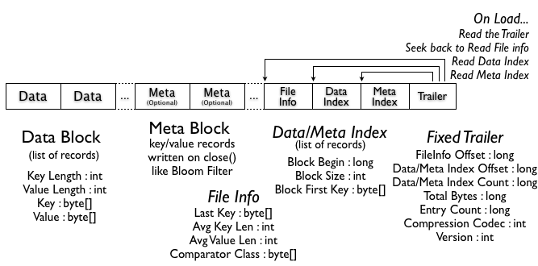

# Hadoop

Hadoop
Apache Hadoop is an open source software project that enables the distributed processing of large data sets across clusters of commodity servers. It is designed to scale up from a single server to thousands of machines, with a very high degree of fault tolerance. Rather than relying on high-end hardware, the resiliency of these clusters comes from the software’s ability to detect and handle failures at the application layer.
Hadoop changes the economics and the dynamics of large scale computing. Its impact can be boiled down to four salient characteristics.
Hadoop enables a computing solution that is:
1. Scalable– New nodes can be added as needed, and added without needing to change data formats, how data is loaded, how jobs are written, or the applications on top.
2. Cost effective– Hadoop brings massively parallel computing to commodity servers. The result is a sizeable decrease in the cost per terabyte of storage, which in turn makes it affordable to model all your data.
3. Flexible– Hadoop is schema-less, and can absorb any type of data, structured or not, from any number of sources. Data from multiple sources can be joined and aggregated in arbitrary ways enabling deeper analyses than any one system can provide.
4. Fault tolerant– When you lose a node, the system redirects work to another location of the data and continues processing without missing a fright beat

# History of Hadoop
1. Hadoop was created by Doug Cutting, the creator of Apache Lucene, the widely used text search library.
2. Hadoop has its origins in Apache Nutch, an open source web search engine, itself a part of the Lucene project.
3. Nutch was started in 2002, and a working crawler and search system quickly emerged. However Mike Cafarella and Doug Cutting realized that their architecture would not scale to the billions of pages on the Web.
3. One publication of a paper in 2003 that described the architecture of Googles distributed filesystem, called GFS, which was being used in production at Google.
4. In particular, GFS would free up time being spent on administrative tasks such as managing storage nodes. In 2004, they set about writing an open source implementation, the Nutch Distributed Filesystem (NDFS), Google published the paper that introduced MapReduce to the world.
5. Early in 2005, the Nutch developers had a working MapReduce implementation in Nutch, and by the middle of that year all the major Nutch algorithms had been ported to run using MapReduce and NDFS.
6. NDFS and the MapReduce implementation in Nutch were applicable beyond the realm of search, and in February 2006 they moved out of Nutch to form an independent subproject of Lucene called Hadoop.
7. At around the same time, Doug Cutting joined Yahoo!, which provided a dedicated team and the resources to turn Hadoop into a system that ran at web scale. This was demonstrated in February 2008 when Yahoo! announced that its production search index was being generated by a 10,000-core Hadoop cluster.
8. In January 2008, Hadoop was made its own top-level project at Apache, confirming its success and its diverse, active community. By this time, Hadoop was being used by many other companies besides Yahoo!, such as Last.fm, Facebook, and the New York Times.

# NameNode
The NameNode is the centerpiece of an HDFS file system. It keeps the directory tree of all files in the file system, and tracks where across the cluster the file data is kept. It does not store the data of these files itself.

Client applications talk to the NameNode whenever they wish to locate a file, or when they want to add/copy/move/delete a file. The NameNode responds the successful requests by returning a list of relevant DataNode servers where the data lives.

The NameNode is a Single Point of Failure for the HDFS Cluster. HDFS is not currently a High Availability system. When the NameNode goes down, the file system goes offline. There is an optional SecondaryNameNode that can be hosted on a separate machine. **SecondaryNameNode only creates checkpoints of the namespace by merging the edits file into the fsimage file and does not provide any real redundancy.** 

During startup, the NameNode must complete certain actions before it can serve client requests:
1. Read file system metadata from the fsimage file.
2. Read edit logs and apply logged operations to the file system metadata.
3. Write a new checkpoint (a new fsimage consisting of the prior fsimage plus the application of all operations from the edit logs).
4. Remain in safe mode until a sufficient number of blocks have been reported by datanodes.

In some situations, these actions can take a long time to complete.  For example:
1. If the edit logs have grown very large, then reading all of the operations and applying them to the metadata will take a long time.  This can occur if there has not been a recent checkpoint, such as due to a long-term outage of the secondary namenode.
2. A degraded disk can slow down performance in any of the I/O-bound steps: reading fsimage, reading edit logs, or writing a new checkpoint.
3. When writing a new checkpoint, the NameNode writes to every one of the redundant locations configured for storing fsimage.  Even though these writes occur in parallel, the NameNode blocks until the writes have completed to every location before it allows client connections.  This means a single slow disk inhibits overall startup performance.

Administrators typically access the NameNode web UI at the first sign of trouble.  Unfortunately, the NameNode wouldn’t start its HTTP server until after writing a new checkpoint.  In a slow startup situation, it could take multiple minutes or even more than an hour after restarting the NameNode before the web UI would be accessible.  It would appear as though the NameNode process had hung during startup.  Only an experienced Hadoop operator would be able to determine that the NameNode is in fact making progress, by using relatively low-level techniques such as inspecting thread dumps.

# DataNode
A DataNode stores data in the HDFS. A functional filesystem has more than one DataNode, with data replicated across them.

On startup, a DataNode connects to the NameNode; spinning until that service comes up. It then responds to requests from the NameNode for filesystem operations.

Client applications can talk directly to a DataNode, once the NameNode has provided the location of the data. Similarly, MapReduce operations farmed out to TaskTracker instances near a DataNode, talk directly to the DataNode to access the files. TaskTracker instances can, indeed should, be deployed on the same servers that host DataNode instances, so that MapReduce operations are performed close to the data.

Functions of DataNode
1. DataNode can read or write a HDFS file (Actually the file is broken into blocks and the NameNode will tell your client which DataNode each block resides in )
2. Upon initialization, each of the DataNodes informs the NameNode of the blocks it is currently storing.
3. After this mapping is complete, the DataNodes continually poll the NameNode to provide information regarding local changes as well as receive instructions to create, move, or delete blocks from the local disk.
4. Your client communicates directly with the DataNode daemons to process the local files corresponding to the blocks.  
5. DataNode may communicate with other DataNodes to replicate its data blocks for redundancy.
6. The DataNodes provide backup store of the blocks and constantly report to the NameNode to keep the metadata current.
7. Backup store of the blocks ensures that if any one DataNode crashes or becomes inaccessible over the network, you will still be able to read the files.

# Secondary Name Node
The Secondary NameNode (SNN) is an assistant daemon for monitoring the state of the cluster HDFS, Like the NameNode, Each cluster has one SNN, and it typically resides on its own machine as well.
No other DataNode or TaskTracker daemons run on the same server.

### Functions of Secondary NameNode
The SNN differs from the NameNode in that this process does not receive or record any real-time changes to HDFS.  

Instead, it communicates with the NameNode to take snapshots of the HDFS metadata at intervals defined by the cluster configuration.

NameNode is a single point of failure for a Hadoop cluster, and the SNN snapshots help minimize the downtime and loss of data.  

Nevertheless, a NameNode failure requires human intervention to reconfigure the cluster to use the SNN as the primary NameNode.

# Multiple NameNodes
While HDFS cluster storage scales horizontally with the addition of datanodes, the namespace does not. Currently the namespace can only be vertically scaled on a single namenode.  The namenode stores the entire file system metadata in memory. This limits the number of blocks, files, and directories supported on the file system to what can be accommodated in the memory of a single namenode. A typical large deployment at Yahoo! includes an HDFS cluster with 2700-4200 datanodes with 180 million files and blocks, and address ~25 PB of storage.  At Facebook, HDFS has around 2600 nodes, 300 million files and blocks, addressing up to 60PB of storage. While these are very large systems and good enough for majority of Hadoop users, a few deployments that might want to grow even larger could find the namespace scalability limiting.

In order to scale the name service horizontally,HDFS federation uses multiple independent namenodes/namespaces. The namenodes are federated, that is, the namenodes are independent and don’t require coordination with each other. The datanodes are used as common storage for blocks by all the namenodes. Each datanode registers with all the namenodes in the cluster. Datanodes send periodic heartbeats and block reports and handles commands from the namenodes.

 
# Replication Factor
HDFS is designed to reliably store very large files across machines in a large cluster. It stores each file as a sequence of blocks; all blocks in a file except the last block are the same size. The blocks of a file are replicated for fault tolerance. The block size and replication factor are configurable per file. An application can specify the number of replicas of a file. The replication factor can be specified at file creation time and can be changed later. Files in HDFS are write-once and have strictly one writer at any time.

The NameNode makes all decisions regarding replication of blocks. It periodically receives a Heartbeat and a Blockreport from each of the DataNodes in the cluster. Receipt of a Heartbeat implies that the DataNode is functioning properly. A Blockreport contains a list of all blocks on a DataNode.

Your HDFS Client (hadoop fs in this case) will be given the block names and datanode locations (the first being the closest location if the NameNode can determine this from the rack awareness script) of where to store these files by the NameNode.

The client then copies the blocks to the closest Data node. The data node is then responsible for copying the block to a second datanode (preferably on another rack), where finally the second will copy to the third (on the same rack as the second).

So your client will only copy data to one of the data nodes, and the framework will take care of the replication between datanodes.

# HBase
HBase was created in 2007 at Powerset(later acquired by Microsoft) and was initially part of the contributions in Hadoop. Since then, it has become its own top-level project under the Apache Software Foundation umbrella. It is available under the Apache Software License, version 2.0.

Facebook uses HBase to power their Messages infrastructure. Other major companies include Mahalo, Stumbleupon, Trend Micro, Twitter

# Hbase vs Cassandra
Hbase and its required supporting systems are derived from what is known of the original Google File System designs( pub. 2003) and Google BigTable(pub. 2006).

Cassandra on the other hand is an open source fork of a standalone database system initially coded by Facebook, which while implementing the BigTable data model, uses a system inspired by Amazon’s Dynamo for storing data (in fact much of the initial development work on  Cassandra was performed by two Dynamo engineers recruited to Facebook from Amazon).

Cassandra's main principle from the view of CAP theorem is **AP ("Availability + tolerance to network Partitions")**. Cassandra provides the ability to choose between different consistency levels. Important read/write operations typically use consistency level “QUORUM”. Other operations can use the consistency level "SINGLE". Thus when a certain number of nodes fail, or the network connecting those nodes falters, the service continues operating in many respects, and only those aspects that require data consistency fail.

HBase on the other hand has the **CP principle ("Consistency + tolerance to network partitions")**. This means that data consistency is more important for HBase than availability.

In practical example,

1. Cassandra is awesome for Random Reads, while Hbase is best for Range Scans.
2. Cassandra has less moving parts than Hbase (HDFS, Zookeeper, Hbase)
3. Cassandra has no single point of failure, All nodes are equal and perform all functions (unlike NameNode and HMaster in Hbase)
4. Cassandra has excellent single-row read performance as long as eventual consistency semantics are sufficient for the use-case. Cassandra quorum reads, which are required for strict consistency will naturally be slower than Hbase reads. Cassandra does not support Range based row-scans which may be limiting in certain use-cases. Cassandra is well suited for supporting single-row queries, or selecting multiple rows based on a Column-Value index.
5. Because of random partitioning, partial rowkeys cannot be used with Cassandra. RowKeys must be known exactly

More here: http://bigdatanoob.blogspot.in/2012/11/hbase-vs-cassandra.html

# CAP Throrem
**CAP Theorem** (by Professor Eric Brewer), is comprised of three components as they relate to distributed data stores:
- **Consistency**: All reads receive the most recent write or an error.
- **Availability**: All reads contain data, but it might not be the most recent.
- **Partition tolerance**: The system continues to operate despite network failures (ie; dropped partitions, slow network connections, or unavailable network connections between nodes.)

### CAP Theorem for Databases and Partition Tolerance
In normal operations, your data store provides all three functions. But the CAP theorem maintains that when a distributed database experiences a network failure, you can provide either consistency or availability.

It’s a tradeoff. All other times, all three can be provided. But, **in the event of a network failure, a choice must be made.**

In the theorem, **partition tolerance is a must**. The assumption is that the system operates on a distributed data store so the system, by nature, operates with network partitions. Network failures will happen, so to offer any kind of reliable service, partition tolerance is necessary—the P of CAP.

That leaves a decision between the other two, C and A. **When a network failure happens, one can choose to guarantee consistency or availability**

### The CAP Theorem vs. ACID (Atomicity, Consistency, Isolation, and Durability)
Consistency in CAP is different than that of ACID. Consistency in CAP means having the most up-to-date information. In ACID, consistency means any new transaction to the database won’t corrupt the database.

# HMaster

The HMaster is responsible for assigning regions to region servers and uses Apache ZooKeeper, a reliable, highly available, persistent and distributed coordination service, to facilitate that task. The HMaster server is also responsible for handling load balancing of regions across region servers, to unload busy servers and move regions to less occupied ones. The master is not part of the actual data storage or retrieval path. It negotiates load balancing and maintains the state of the cluster, but never provides any data services to either the region servers or the clients, and is therefore lightly loaded in practice. In addition, it takes care of schema changes and other metadata operations, such as creation of tables and column families.

# Multiple HMasters

An HBase cluster has one active master. If many masters are started, all compete. Whichever wins goes on to run the cluster. All others park themselves in their constructor until master or cluster shutdown or until the active master loses its lease in zookeeper. Thereafter, all running master jostle to take over master role.

# Backup Master

The HMaster server controls the HBase cluster. You can start up to 9 backup HMaster servers, which makes 10 total HMasters, counting the primary. To start a backup HMaster, use the local-master-backup.sh. For each backup master you want to start, add a parameter representing the port offset for that master. Each HMaster uses three ports (16010, 16020, and 16030 by default). The port offset is added to these ports, so using an offset of 2, the backup HMaster would use ports 16012, 16022, and 16032. The following command starts 3 backup servers using ports 16012/16022/16032, 16013/16023/16033, and 16015/16025/16035.

$ ./bin/local-master-backup.sh 2 3 5            

           

To kill a backup master without killing the entire cluster, you need to find its process ID (PID). The PID is stored in a file with a name like /tmp/hbase-USER-X-master.pid. The only contents of the file are the PID. You can use the kill -9 command to kill that PID. The following command will kill the master with port offset 1, but leave the cluster running:

$ cat /tmp/hbase-testuser-1-master.pid |xargs kill -9           

# Zookeeper

ZooKeeper is a separate open source project, and is also part of the Apache Software Foundation. ZooKeeper is the comparable system to Google’s use of Chubby for Bigtable. It offers filesystem-like access with directories and files (called znodes) that distributed systems can use to negotiate ownership, register services, or watch for updates.

Every region server creates its own ephemeral node in ZooKeeper, which the master, in turn, uses to discover available servers. They are also used to track server failures or network partitions.

Ephemeral nodes are bound to the session between ZooKeeper and the client which created it. The session has a heartbeat keepalive mechanism that, once it fails to report, is declared lost by ZooKeeper and the associated ephemeral nodes are deleted.

HBase uses ZooKeeper also to ensure that there is only one master running, to store the bootstrap location for region discovery, as a registry for region servers, as well as for other purposes. ZooKeeper is a critical component, and without it HBase is not operational. This is mitigated by ZooKeeper’s distributed design using an assemble of servers and the Zab protocol to keep its state consistent.

Although most znodes are only useful to HBase, some — such as the list of RegionServers (/hbase/rs) or list of Unassigned Regions (/hbase/unassigned) — may be used for debugging or monitoring purposes. Or, as in the case with /hbase/draining, you may interact with them to let HBase know what you’re doing with the cluster.

# Zookeeper - Workflow

Once a ZooKeeper ensemble starts, it will wait for the clients to connect. Clients will connect to one of the nodes in the ZooKeeper ensemble. It may be a leader or a follower node. Once a client is connected, the node assigns a session ID to the particular client and sends an acknowledgement to the client. If the client does not get an acknowledgment, it simply tries to connect another node in the ZooKeeper ensemble. Once connected to a node, the client will send heartbeats to the node in a regular interval to make sure that the connection is not lost.

If a client wants to read a particular znode, it sends a read request to the node with the znode path and the node returns the requested znode by getting it from its own database. For this reason, reads are fast in ZooKeeper ensemble.
If a client wants to store data in the ZooKeeper ensemble, it sends the znode path and the data to the server. The connected server will forward the request to the leader and then the leader will reissue the writing request to all the followers. If only a majority of the nodes respond successfully, then the write request will succeed and a successful return code will be sent to the client. Otherwise, the write request will fail. The strict majority of nodes is called as Quorum.

# Regions and Region Servers

HBase is the Hadoop storage manager that provides low-latency random reads and writes on top of HDFS, and it can handle petabytes of data. One of the interesting capabilities in HBase is auto-sharding, which simply means that tables are dynamically distributed by the system when they become too large.

The basic unit of horizontal scalability in HBase is called a Region. Regions are a subset of the table’s data and they are essentially a contiguous, sorted range of rows that are stored together.

Initially, there is only one region for a table. When regions become too large after adding more rows, the region is split into two at the middle key, creating two roughly equal halves.

In HBase the slaves are called Region Servers. Each Region Server is responsible to serve a set of regions, and one Region (i.e. range of rows) can be served only by one Region Server.

The HBase architecture has two main services: HMaster that is responsible to coordinate the cluster and execute administrative operations, and the HRegionServer responsible for handling a subset of the table’s data.

A Region Server can serve one or more Regions. Each Region is assigned to a Region Server on startup and the master can decide to move a Region from one Region Server to another as the result of a load balance operation. The Master also handles Region Server failures by assigning the region to another Region Server.

**The mapping of Regions and Region Servers is kept in a system table called META. By reading META, you can identify which region is responsible for your key**. This means that for read and write operations, the master is not involved at all and clients can go directly to the Region Server responsible to serve the requested data.

# Locating a Row-Key: Which Region Server is Responsible?

To put or get a row clients don’t have to contact the master, clients can directly contact the Region Server that handles the specified row, or in case of a client scan, can directly contact the set of Region Servers responsible for handling the set of keys:

To identify the Region Server, the client does a query on the META table.

META is a system table used to keep track of regions. It contains the server name and a region identifier comprising a table name and the start row-key. By looking at the start-key and the next region start-key clients are able to identify the range of rows contained in a particular region.

The client keeps a cache for the region locations. This avoids clients to hit the META table every time an operation on the same region is issued. In case of a region split or move to another Region Server (due to balancing, or assignment policies), the client will receive an exception as response and the cache will be refreshed by fetching the updated information from the META table:

Since META is a table like the others, the client has to identify on which server META is located. **The META locations are stored in a ZooKeeper node on assignment by the Master**, and the client reads directly the node to get the address of the Region Server that contains META.

HBase’s original design was based on BigTable, with another table called -ROOT- containing the META locations and Apache ZooKeeper pointing to it. HBase 0.96 removed that arrangement in favor of ZooKeeper only, since META cannot be split and therefore consists of a single region.

# HStore, WALs

The write path is how an HBase completes put or delete operations. This path begins at a client, moves to a region server, and ends when data eventually is written to an HBase data file called an HFile. Included in the design of the write path are features that HBase uses to prevent data loss in the event of a region server failure.

Each HBase table is hosted and managed by sets of servers which fall into three categories:

1. One active master server

2. One or more backup master servers

3. Many region servers

Region servers contribute to handling the HBase tables. Because HBase tables can be large, they are broken up into partitions called regions. Each region server handles one or more of these regions. Note that because region servers are the only servers that serve HBase table data, a master server crash cannot cause data loss.

HBase data is organized similarly to a sorted map, with the sorted key space partitioned into different shards or regions. An HBase client updates a table by invoking put or delete commands. When a client requests a change, that request is routed to a region server right away by default. However, programmatically, a client can cache the changes in the client side, and flush these changes to region servers in a batch, by turning the autoflush off. If autoflush is turned off, the changes are cached until flush-commits is invoked, or the buffer is full depending on the buffer size set programmatically or configured with parameter “hbase.client.write.buffer”.

Since the row key is sorted, it is easy to determine which region server manages which key. A change request is for a specific row. Each row key belongs to a specific region which is served by a region server. So based on the put or delete’s key, an HBase client can locate a proper region server. At first, it locates the address of the region server hosting the -META- region from the ZooKeeper quorum.  From the meta region server, then we finally locate the actual region server which serves the requested region.  This is a three-step process, so the region location is cached to avoid this expensive series of operations. If the cached location is invalid (for example, we get some unknown region exception), it’s time to re-locate the region and update the cache.

After the request is received by the right region server, the change cannot be written to a HFile immediately because the data in a HFile must be sorted by the row key. This allows searching for random rows efficiently when reading the data. Data cannot be randomly inserted into the HFile. Instead, the change must be written to a new file. If each update were written to a file, many small files would be created. Such a solution would not be scalable nor efficient to merge or read at a later time. Therefore, changes are not immediately written to a new HFile.

Instead, each change is stored in a place in memory called the memstore, which cheaply and efficiently supports random writes. Data in the memstore is sorted in the same manner as data in a HFile. When the memstore accumulates enough data, the entire sorted set is written to a new HFile in HDFS. Completing one large write task is efficient and takes advantage to HDFS’ strengths.

Although writing data to the memstore is efficient, it also introduces an element of risk: Information stored in memstore is stored in volatile memory, so if the system fails, all memstore information is lost. To help mitigate this risk, HBase saves updates in a write-ahead-log (WAL) before writing the information to memstore. In this way, if a region server fails, information that was stored in that server’s memstore can be recovered from its WAL.

Note: By default, WAL is enabled, but the process of writing the WAL file to disk does consume some resources. WAL may be disabled, but this should only be done if the risk of data loss is not a concern. If you choose to disable WAL, consider implementing your own disaster recovery solution or be prepared for the possibility of data loss.

The data in a WAL file is organized differently from HFile. WAL files contain a list of edits, with one edit representing a single put or delete. The edit includes information about the change and the region to which the change applies. Edits are written chronologically, so, for persistence, additions are appended to the end of the WAL file that is stored on disk. Because WAL files are ordered chronologically, there is never a need to write to a random place within the file.

As WALs grow, they are eventually closed and a new, active WAL file is created to accept additional edits. This is called “rolling” the WAL file. Once a WAL file is rolled, no additional changes are made to the old file.

By default, WAL file is rolled when its size is about 95% of the HDFS block size. You can configure the multiplier using parameter: “hbase.regionserver.logroll.multiplier”, and the block size using parameter: “hbase.regionserver.hlog.blocksize”. WAL file is also rolled periodically based on configured interval “hbase.regionserver.logroll.period”, an hour by default, even the WAL file size is smaller than the configured limit.

Constraining WAL file size facilitates efficient file replay if a recovery is required. This is especially important during replay of a region’s WAL file because while a file is being replayed, the corresponding region is not available. The intent is to eventually write all changes from each WAL file to disk and persist that content in an HFile. After this is done, the WAL file can be archived and it is eventually deleted by the LogCleaner daemon thread.  Note that WAL files serve as a protective measure. WAL files need only be replayed to recover updates that would otherwise be lost after a region server crash.

A region server serves many regions, but does not have a WAL file for each region. Instead, one active WAL file is shared among all regions served by the region server. Because WAL files are rolled periodically, one region server may have many WAL files. Note that there is only one active WAL per region server at a given time.

Each edit in the WAL file has a unique sequence id. This id increases to preserve the order of edits. Whenever a log file is rolled, the next sequence id and the old file name are put in an in-memory map. This information is used to track the maximum sequence id of each WAL file so that we can easily figure out if a file can be archived at a later time when some memstore is flushed to disk.

Edits and their sequence ids are unique within a region. Any time an edit is added to the WAL log, the edit’s sequence id is also recorded as the last sequence id written. When the memstore is flushed to disk, the last sequence id written for this region is cleared. If the last sequence id written to disk is the same as the maximum sequence id of a WAL file, it can be concluded that all edits in a WAL file for this region have been written to disk. If all edits for all regions in a WAL file have been written to disk, it is clear that no splitting or replaying will be required, and the WAL file can be archived.

WAL file rolling and memstore flush are two separate actions, and don’t have to happen together. However, we don’t want to keep too many WAL files per region server so as to avoid time-consuming recovery in case a region server failure. Therefore, when a WAL file is rolled, HBase checks if there are too many WAL files, and decide what regions should be flushed so that some WAL files can be archived.

# KeyValue Format

In essence, each KeyValue in the HFile is a low-level byte array that allows for zero copy access to the data.

The structure starts with two fixed-length numbers indicating the size and value of the key. With that information, you can offset into the array to, for example, get direct access to the value, ignoring the key. Otherwise, you can get the required information from the key.  
The timestamp is a long identifying (by default) the creation time of the of the cell. Each cell (as opposed to row) is versioned, which makes it interesting to reason about consistency and ACID guarantees (more on that later). No data is ever overwritten or changed in place, instead every "update" creates a new version of the affected set of cells.  

You should not think of a row like this:  
(key, column value 1, column value 2, NULL, column value 4, ...)  
But rather like this:  
(rowkey, column family, column1, timestamp) -> column value 1  
(rowkey, column family, column2, timestamp) -> column value 2  
(rowkey, column family, column4, timestamp) -> column value 4  

HBase ensures that all new versions created by single Put operation for a particular rowkey are either all seen by other clients or seen by none.  
Furthermore a Get or Scan will only return a combination of versions of cells for a row that existed together at some point. This ensures that no client will ever see a partially completed update or delete.  
HBase achieves this by using a variation of Multi Version Currency Control (mvcc).  

# HFile v1
In HBase 0.20, MapFile is replaced by HFile: a specific map file implementation for HBase. The idea is quite similar to MapFile, but it adds more features than just a plain key/value file. Features such as support for metadata and the index is now kept in the same file.

The data blocks contain the actual key/values as a MapFile. For each “block close operation” the first key is added to the index, and the index is written on HFile close.

The HFile format also adds two extra “metadata” block types: Meta and FileInfo. These two key/value blocks are written upon file close.

The Meta block is designed to keep a large amount of data with its key as a String, while FileInfo is a simple Map preferred for small information with keys and values that are both byte-array. Regionserver’s StoreFile uses Meta-Blocks to store a Bloom Filter, and FileInfo for Max SequenceId, Major compaction key and Timerange info. This information is useful to avoid reading the file if there’s no chance that the key is present (Bloom Filter), if the file is too old (Max SequenceId) or if the file is too new (Timerange) to contain what we’re looking for.

# HFile v2
In HBase 0.92, the HFile format was changed a bit (HBASE-3857) to improve the performance when large amounts of data are stored. One of the main problems with the HFile v1 is that you need to load all the monolithic indexes and large Bloom Filters in memory, and to solve this problem v2 introduces multi-level indexes and a block-level Bloom Filter. As a result, HFile v2 features improved speed, memory, and cache usage.

The main feature of this v2 are “inline blocks”, the idea is to break the index and Bloom Filter per block, instead of having the whole index and Bloom Filter of the whole file in memory. In this way you can keep in ram just what you need.  
Since the index is moved to block level you then have a multi-level index, meaning each block has its own index (leaf-index). The last key of each block is kept to create the intermediate/index that makes the multilevel-index b+tree like.

The block header now contains some information: The “Block Magic” field was replaced by the “Block Type” field that describes the content of the block “Data”, Leaf-Index, Bloom, Metadata, Root-Index, etc. Also three fields (compressed/uncompressed size and offset prev block) were added to allow fast backward and forward seeks.

### Data Block Encodings
Since keys are sorted and usually very similar, it is possible to design a better compression than what a general purpose algorithm can do.

HBASE-4218 tried to solve this problem, and in HBase 0.94 you can choose between a couple of different algorithms: Prefix and Diff Encoding.

The main idea of Prefix Encoding is to store the common prefix only once, since the rows are sorted and the beginning is typically the same.

The Diff Encoding pushes this concept further. Instead of considering the key as an opaque sequence of bytes, the Diff Encoder splits each key field in order to compress each part in a better way. This being that the column family is stored once. If the key length, value length and type are the same as the row prior, the field is omitted. Also, for increased compression, the timestamp is stored is stored as a Diff from the previous one.  

 

Note that this feature is off by default since writing and scanning are slower but more data is cached. To enable this feature you can set DATA_BLOCK_ENCODING = PREFIX | DIFF | FAST_DIFF in the table info.

# HFile v3
HBASE-5313 contains a proposal to restructure the HFile layout to improve compression:
* Pack all keys together at beginning of the block and all the value together at the end of the block. In this way you can use two different algorithms to compress key and values.
* Compress timestamps using the XOR with the first value and use VInt instead of long.

# Compaction
Apache HBase is a distributed data store based upon a log-structured merge tree, so optimal read performance would come from having only one file per store (Column Family). However, that ideal isn’t possible during periods of heavy incoming writes. Instead, **HBase will try to combine HFiles to reduce the maximum number of disk seeks needed for a read**. This process is called compaction.

Compactions choose some files from a single store in a region and combine them. This process involves reading KeyValues in the input files and writing out any KeyValues that are not deleted, are inside of the time to live (TTL), and don’t violate the number of versions. The newly created combined file then replaces the input files in the region.

Now, whenever a client asks for data, HBase knows the data from the input files are held in one contiguous file on disk — hence only one seek is needed, whereas previously one for each file could be required. But disk IO isn’t free, and without careful attention, rewriting data over and over can lead to some serious network and disk over-subscription. In other words, compaction is about trading some disk IO now for fewer seeks later.

The ideal compaction would pick the files that will reduce the most seeks in upcoming reads while also choosing files that will need the least amount of IO. Unfortunately, that problem isn’t solvable without knowledge of the future. As such, it’s just an ideal that HBase should strive for and not something that’s ever really attainable.

Instead of the impossible ideal, HBase uses a heuristic to try and choose which files in a store are likely to be good candidates. The files are chosen on the intuition that like files should be combined with like files – meaning, files that are about the same size should be combined.

The default policy in HBase 0.94 looks through the list of HFiles, trying to find the first file that has a size less than the total of all files multiplied by hbase.store.compaction.ratio. Once that file is found, the HFile and all files with smaller sequence ids are chosen to be compacted.  
However, this assumption about the correlation between age and size of files is faulty in some cases, leading the current algorithm to choose sub-optimally. Rather, bulk-loaded files can and sometimes do sort very differently from the more normally flushed HFiles, so they make great examples:

For Hbase 0.96, The default compaction selection algorithm was also changed to ExploringCompactionPolicy. This policy is different from the old default in that it ensures that every single file in a proposed compaction is within the given ratio. Also, it doesn’t just choose the first set of files that have sizes within the compaction ratio; instead it looks at all the possible sets that don’t violate any rules, and then chooses something that looks to be most impactful for the least amount of IO expected.  To do that, the ExploringCompactionPolicy chooses a compaction that will remove the most files within the ratio, and if there is a tie, preference is given to the set of files that are smaller in size:

More changes are planned for future releases, including tiered compaction, striped compaction, and level-based compaction.

# YARN vs MapReduce v1.0

Apache Hadoop YARN is the data operating system for Hadoop 2. YARN enables a user to interact with all data in multiple ways simultaneously, making Hadoop a true multi-use data platform and allowing it to take its place in a modern data architecture.

YARN, as a cluster operating system, provides two distinct capabilities to applications: resource management and workload management. Now, resource management refers to resource allocation and attendant resource isolation across a cluster of many thousands of nodes and tens of thousands of applications including aspects such as tracking node failures, availability of resources at individual machines etc., whereas workload management refers to mechanics of deciding whom to allocate resources to (applications, users, queues), SLAs for allocation (e.g. via preemption) and so on.

MapReduce has undergone a complete overhaul in hadoop-0.23 and we now have, what we call, MapReduce 2.0 (MRv2) or YARN.

The fundamental idea of MRv2 is to split up the two major functionalities of the JobTracker: **resource management and job scheduling/monitoring**, into separate daemons. The idea is to have a global ResourceManager (RM) and per-application ApplicationMaster (AM). An application is either a single job in the classical sense of Map-Reduce jobs or a DAG of jobs.

The ResourceManager and per-node slave, the NodeManager (NM), form the data-computation framework. The ResourceManager is the ultimate authority that arbitrates resources among all the applications in the system.

The per-application ApplicationMaster is, in effect, a framework specific library and is tasked with negotiating resources from the ResourceManager and working with the NodeManager(s) to execute and monitor the tasks.

The ResourceManager has two main components: Scheduler and ApplicationsManager.

The Scheduler is responsible for allocating resources to the various running applications subject to familiar constraints of capacities, queues etc. The Scheduler is pure scheduler in the sense that it performs no monitoring or tracking of status for the application. Also, it offers no guarantees about restarting failed tasks either due to application failure or hardware failures. The Scheduler performs its scheduling function based the resource requirements of the applications; it does so based on the abstract notion of a resource Container which incorporates elements such as memory, cpu, disk, network etc.

The Scheduler has a pluggable policy plug-in, which is responsible for partitioning the cluster resources among the various queues, applications etc. The current Map-Reduce schedulers such as the CapacityScheduler and the FairScheduler would be some examples of the plug-in.

The ApplicationsManager is responsible for accepting job-submissions, negotiating the first container for executing the application specific ApplicationMaster and provides the service for restarting the ApplicationMaster container on failure.

The NodeManager is the per-machine framework agent who is responsible for containers, monitoring their resource usage (cpu, memory, disk, network) and reporting the same to the ResourceManager/Scheduler.

| Basis for comparison | YARN | Map Reduce |
|-------|---|---|
| Meaning | YARN Stands for Yet Another Resource Negotiator. | Map Reduce is self-defined. |
| Version | Introduced in Hadoop 2.0 | Introduced in Hadoop 1.0 |
| Responsibility |Now YARN is responsible for Resource management part. | Earlier Map reduce was responsible for Resource Management as well as data processing |
| Execution model | Yarn execution model is more generic as compare to Map reduce | Less Generic as compare to YARN. |
| Application execution | YARN can execute those applications as well which don’t follow Map Reduce model| Map Reduce can execute their own model based application.|
| Architecture | YARN is introduced in MR2 on top of job tracker and task tracker. In the place of job tracker and task tracker Application, the master comes into the picture. |In the earlier version of MR1, YARN is not there In the place of YARN job tracker and task tracker was present which help in the execution of application or jobs|
| Flexibility | YARN is more isolated and scalable | Less scalable as compare to YARN. |
| Daemons | YARN has Name Node, Data node, secondary Name node, Resource Manager and Node Manager. | Map Reduce has Name node, Data node, Secondary Name node, job tracker and task tracker. |
| Limitation | There is no concept of single point of failure in YARN because it has multiple Masters so if one got failed another master will pick it up and resume the execution.| Single point of failure, low resource utilization(Max of 4200 clusters by YAHOO) and less scalability when compare to YARN |
| Size | By default the size of a data node in YARN is 128MB | By default the size of a data node in Map reduce is 64MB.|

# YARN – Walk through

Armed with the knowledge of the above concepts, it will be useful to sketch how applications conceptually work in YARN.

Application execution consists of the following steps:

1. Application submission.

2. Bootstrapping the ApplicationMaster instance for the application.

3. Application execution managed by the ApplicationMaster instance.

Let’s walk through an application execution sequence (steps are illustrated in the diagram):

1. A client program submits the application, including the necessary specifications to launch the application-specific ApplicationMaster itself.
2. The ResourceManager assumes the responsibility to negotiate a specified container in which to start the ApplicationMaster and then launches the ApplicationMaster.
3. The ApplicationMaster, on boot-up, registers with the ResourceManager – the registration allows the client program to query the ResourceManager for details, which allow it to  directly communicate with its own ApplicationMaster.
4. During normal operation the ApplicationMaster negotiates appropriate resource containers via the resource-request protocol.
5. On successful container allocations, the ApplicationMaster launches the container by providing the container launch specification to the NodeManager. The launch specification, typically, includes the necessary information to allow the container to communicate with the ApplicationMaster itself. The application code executing within the container then provides necessary information (progress, status etc.) to its ApplicationMaster via an application-specific protocol.
6. During the application execution, the client that submitted the program communicates directly with the ApplicationMaster to get status, progress updates etc. via an application-specific protocol.
7. Once the application is complete, and all necessary work has been finished, the ApplicationMaster deregisters with the ResourceManager and shuts down, allowing its own container to be repurposed.

# Cloudera

They were the first on the market with their Cloudera Distribution including Apache Hadoop (CDH). This helped them to acquire valuable experience and to establish a solid customer base. Besides the core Hadoop platform (HDFS, MapReduce, Hadoop Commons), CDH integrates 10 open source projects including HBase, Mahout, Pig, ZooKeeper, and others. Cloudera offers CDH, which is 100% open source, as a free download as well as a free edition of their Cloudera Manager console for administering and managing Hadoop clusters of up to 50 nodes. The enterprise version on the other hand combines CDH and a more sophisticated Manager plus an enterprise support package.

# Hortonworks

Hortonworks (spun from Yahoo) have Hortonworks Data Platform (HDP). The HDP distro is 100% Apache open source code. The major difference from Cloudera and MapR is that HDP uses Apache Ambari for cluster management and monitoring. In its current 0.9 version, Ambari certainly can’t be so mature as Cloudera’s Manager or MapR’s Heatmap. The Hortonworks Data Platform is open source to its core  – no proprietary layers. You’ll therefore never have a vendor lock-in.

The real driver of Hortonworks strategy is safe embeddability. Hortonworks has partnerships with Microsoft and Teradata, who have blessed the Hortonworks distribution and are incorporating it into their data warehouse ecosystems. These larger players have a massive installed base and well-developed channels that will introduce Hadoop into thousands of accounts.

@ MapR

The major differences to CDH and HDP is that MapR uses their proprietary file system MapR-FS instead of HDFS. The reason for their Unix-based file system is that MapR considers HDFS as a single point of failure. The current version (v2.0) of their product is based on Apache Hadoop 0.20.2 and is known as M3 and M5. The fundamental difference between the free community edition M3 and the enterprise edition M5, is the extra high-availability features. There is MapR 2.o Beta available which I suppose will be built on Hadoop 2.0.

Other players include DataStax( best known as a commercial Cassandra distribution), and EMC Greenplum (which also resells MapR M5 distribution)

More here http://wikibon.org/wiki/v/The_Hadoop_Wars:_Cloudera_and_Hortonworks%E2%80%99_Death_Match_for_Mindshare

